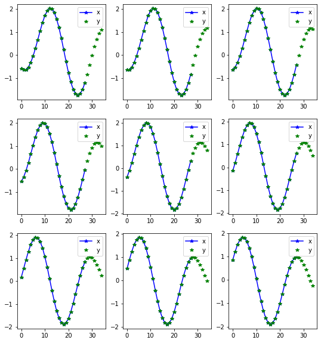
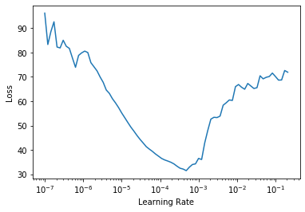
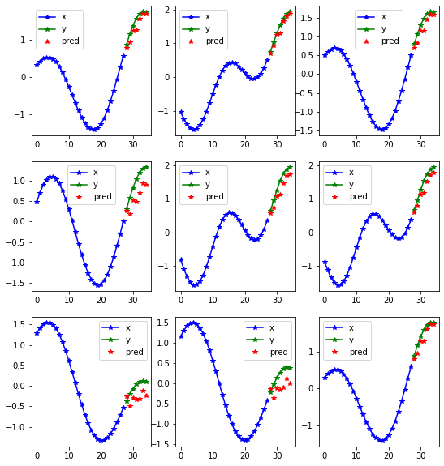
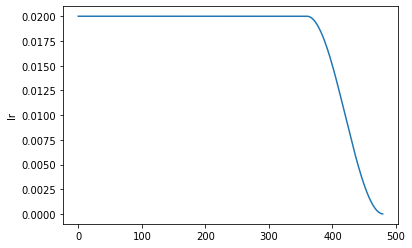
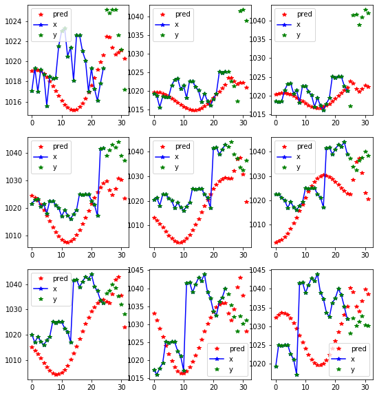
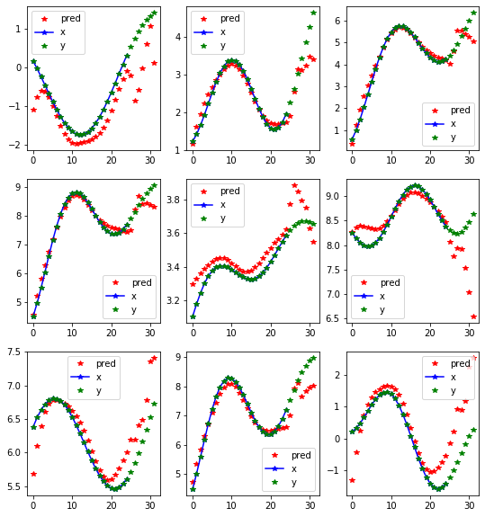

# Fastseq
> A way to use fastai with sequence data


## Installing

Please install [fastai2](https://dev.fast.ai/#Installing) according to the instructions.

Then install Fastseq by:
```
pip install -e .
```

## How to use

```python
from fastai2.basics import *
from fastseq.all import *
from fastseq.nbeats.model import *
from fastseq.nbeats.learner import *
horizon, lookback = 7, 25    
```

Getting the data fastai style:

```python
items = dummy_data_generator(60, 10, nrows=300)
data = TSDataLoaders.from_items(items,horizon = horizon, lookback = lookback, step=5,valid_pct=.2)
```

    Train:1500; Valid: 300; Test 300


```python
data.show_batch()
```





```python
learn =nbeats_learner(data)   
```

```python
from fastai2.callback.all import *
learn.lr_find()       
```





```python
learn.fit_flat_cos(20, 2e-2)
learn.recorder.plot_loss()
learn.recorder.plot_sched()
```


<table border="1" class="dataframe">
  <thead>
    <tr style="text-align: left;">
      <th>epoch</th>
      <th>train_loss</th>
      <th>valid_loss</th>
      <th>mae</th>
      <th>smape</th>
      <th>b_loss</th>
      <th>theta</th>
      <th>time</th>
    </tr>
  </thead>
  <tbody>
    <tr>
      <td>0</td>
      <td>1.624049</td>
      <td>1.284563</td>
      <td>0.759560</td>
      <td>0.975853</td>
      <td>0.450282</td>
      <td>2.760517</td>
      <td>00:02</td>
    </tr>
    <tr>
      <td>1</td>
      <td>1.482979</td>
      <td>0.982669</td>
      <td>0.634794</td>
      <td>0.857715</td>
      <td>0.311236</td>
      <td>2.659375</td>
      <td>00:02</td>
    </tr>
    <tr>
      <td>2</td>
      <td>1.384616</td>
      <td>0.887147</td>
      <td>0.600295</td>
      <td>0.825266</td>
      <td>0.281954</td>
      <td>2.543423</td>
      <td>00:02</td>
    </tr>
    <tr>
      <td>3</td>
      <td>1.310885</td>
      <td>0.881163</td>
      <td>0.594149</td>
      <td>0.817573</td>
      <td>0.258415</td>
      <td>2.819199</td>
      <td>00:02</td>
    </tr>
    <tr>
      <td>4</td>
      <td>1.267211</td>
      <td>0.816917</td>
      <td>0.552809</td>
      <td>0.787713</td>
      <td>0.203317</td>
      <td>2.955429</td>
      <td>00:02</td>
    </tr>
    <tr>
      <td>5</td>
      <td>1.229977</td>
      <td>0.811555</td>
      <td>0.540651</td>
      <td>0.742238</td>
      <td>0.212535</td>
      <td>3.129152</td>
      <td>00:02</td>
    </tr>
    <tr>
      <td>6</td>
      <td>1.203240</td>
      <td>0.786385</td>
      <td>0.558036</td>
      <td>0.778185</td>
      <td>0.243013</td>
      <td>3.053049</td>
      <td>00:02</td>
    </tr>
    <tr>
      <td>7</td>
      <td>1.173879</td>
      <td>0.797882</td>
      <td>0.546092</td>
      <td>0.749452</td>
      <td>0.216076</td>
      <td>2.890859</td>
      <td>00:02</td>
    </tr>
    <tr>
      <td>8</td>
      <td>1.149664</td>
      <td>0.825174</td>
      <td>0.580364</td>
      <td>0.826054</td>
      <td>0.234946</td>
      <td>2.932342</td>
      <td>00:02</td>
    </tr>
    <tr>
      <td>9</td>
      <td>1.140661</td>
      <td>0.791325</td>
      <td>0.547702</td>
      <td>0.765976</td>
      <td>0.222041</td>
      <td>3.032246</td>
      <td>00:02</td>
    </tr>
    <tr>
      <td>10</td>
      <td>1.132812</td>
      <td>0.837174</td>
      <td>0.587457</td>
      <td>0.811846</td>
      <td>0.272231</td>
      <td>3.009760</td>
      <td>00:02</td>
    </tr>
    <tr>
      <td>11</td>
      <td>1.137955</td>
      <td>0.828813</td>
      <td>0.564809</td>
      <td>0.776755</td>
      <td>0.225943</td>
      <td>2.926420</td>
      <td>00:02</td>
    </tr>
    <tr>
      <td>12</td>
      <td>1.138237</td>
      <td>0.816143</td>
      <td>0.589003</td>
      <td>0.817768</td>
      <td>0.265081</td>
      <td>3.113065</td>
      <td>00:02</td>
    </tr>
    <tr>
      <td>13</td>
      <td>1.130015</td>
      <td>0.770691</td>
      <td>0.549381</td>
      <td>0.783165</td>
      <td>0.232420</td>
      <td>3.094460</td>
      <td>00:02</td>
    </tr>
    <tr>
      <td>14</td>
      <td>1.139554</td>
      <td>0.807767</td>
      <td>0.568536</td>
      <td>0.809272</td>
      <td>0.242525</td>
      <td>2.672559</td>
      <td>00:02</td>
    </tr>
    <tr>
      <td>15</td>
      <td>1.137876</td>
      <td>0.786121</td>
      <td>0.531929</td>
      <td>0.745779</td>
      <td>0.209692</td>
      <td>2.624779</td>
      <td>00:02</td>
    </tr>
    <tr>
      <td>16</td>
      <td>1.118939</td>
      <td>0.753570</td>
      <td>0.515994</td>
      <td>0.720568</td>
      <td>0.178286</td>
      <td>2.575802</td>
      <td>00:02</td>
    </tr>
    <tr>
      <td>17</td>
      <td>1.102777</td>
      <td>0.755446</td>
      <td>0.536693</td>
      <td>0.760211</td>
      <td>0.216840</td>
      <td>2.750068</td>
      <td>00:02</td>
    </tr>
    <tr>
      <td>18</td>
      <td>1.093155</td>
      <td>0.730887</td>
      <td>0.505811</td>
      <td>0.707161</td>
      <td>0.168065</td>
      <td>2.681139</td>
      <td>00:01</td>
    </tr>
    <tr>
      <td>19</td>
      <td>1.081779</td>
      <td>0.730846</td>
      <td>0.502892</td>
      <td>0.704664</td>
      <td>0.164869</td>
      <td>2.657114</td>
      <td>00:02</td>
    </tr>
  </tbody>
</table>








```python
learn.show_results(0)
```





```python
learn.show_results(1)
```





## Interperation

```python
learn.n_beats_attention.means()
```


<div>
<style scoped>
    .dataframe tbody tr th:only-of-type {
        vertical-align: middle;
    }

    .dataframe tbody tr th {
        vertical-align: top;
    }

    .dataframe thead th {
        text-align: right;
    }
</style>
<table border="1" class="dataframe">
  <thead>
    <tr style="text-align: right;">
      <th></th>
      <th>trend0_0</th>
      <th>trend0_1</th>
      <th>seasonality1_0</th>
      <th>seasonality1_1</th>
      <th>seasonality1_2</th>
      <th>seasonality1_3</th>
    </tr>
  </thead>
  <tbody>
    <tr>
      <th>theta_0_mean</th>
      <td>-0.074099414</td>
      <td>-0.07426101</td>
      <td>0.4293354</td>
      <td>0.15625</td>
      <td>-1.5939595</td>
      <td>0.35737035</td>
    </tr>
    <tr>
      <th>theta_0_std</th>
      <td>0.18427914</td>
      <td>0.18240511</td>
      <td>1.1435487</td>
      <td>0.54097944</td>
      <td>0.81059384</td>
      <td>1.2032012</td>
    </tr>
    <tr>
      <th>theta_1_mean</th>
      <td>-0.006618</td>
      <td>-0.0060307784</td>
      <td>-0.733439</td>
      <td>-0.92187035</td>
      <td>0.69952923</td>
      <td>-0.35547772</td>
    </tr>
    <tr>
      <th>theta_1_std</th>
      <td>0.018844062</td>
      <td>0.009154702</td>
      <td>0.4438819</td>
      <td>0.27048832</td>
      <td>0.45268404</td>
      <td>0.6103023</td>
    </tr>
    <tr>
      <th>theta_2_mean</th>
      <td>-0.0016885607</td>
      <td>0.00012500375</td>
      <td>-0.53056526</td>
      <td>0.15625</td>
      <td>0.25669834</td>
      <td>-1.6763806e-07</td>
    </tr>
    <tr>
      <th>theta_2_std</th>
      <td>0.00072945596</td>
      <td>0.0004879491</td>
      <td>1.193347</td>
      <td>0.54097944</td>
      <td>0.41068566</td>
      <td>4.3785803e-07</td>
    </tr>
    <tr>
      <th>att_mean</th>
      <td>0.947958</td>
      <td>0.41586</td>
      <td>0.490716</td>
      <td>0.289062</td>
      <td>0.64974</td>
      <td>0.584103</td>
    </tr>
    <tr>
      <th>att_std</th>
      <td>0.221936</td>
      <td>0.490302</td>
      <td>0.49319</td>
      <td>0.453327</td>
      <td>0.474961</td>
      <td>0.466623</td>
    </tr>
    <tr>
      <th>theta_3_mean</th>
      <td>NaN</td>
      <td>-6.5637076e-05</td>
      <td>NaN</td>
      <td>-0.078125</td>
      <td>1.5937493</td>
      <td>-0.07927033</td>
    </tr>
    <tr>
      <th>theta_3_std</th>
      <td>NaN</td>
      <td>9.4638235e-05</td>
      <td>NaN</td>
      <td>0.27048972</td>
      <td>0.81101006</td>
      <td>0.92355716</td>
    </tr>
    <tr>
      <th>theta_4_mean</th>
      <td>NaN</td>
      <td>NaN</td>
      <td>NaN</td>
      <td>NaN</td>
      <td>3.9115548e-08</td>
      <td>-0.3905308</td>
    </tr>
    <tr>
      <th>theta_4_std</th>
      <td>NaN</td>
      <td>NaN</td>
      <td>NaN</td>
      <td>NaN</td>
      <td>2.5492858e-07</td>
      <td>0.8090458</td>
    </tr>
    <tr>
      <th>theta_5_mean</th>
      <td>NaN</td>
      <td>NaN</td>
      <td>NaN</td>
      <td>NaN</td>
      <td>NaN</td>
      <td>-0.030955186</td>
    </tr>
    <tr>
      <th>theta_5_std</th>
      <td>NaN</td>
      <td>NaN</td>
      <td>NaN</td>
      <td>NaN</td>
      <td>NaN</td>
      <td>0.11994398</td>
    </tr>
  </tbody>
</table>
</div>


