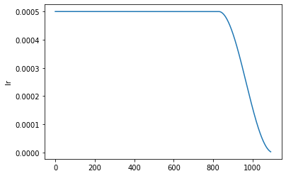
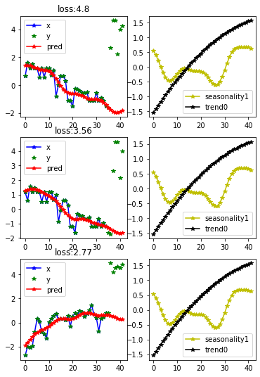

<!--

#################################################
### THIS FILE WAS AUTOGENERATED! DO NOT EDIT! ###
#################################################
# file to edit: nbs/index.ipynb
# command to build the docs after a change: nbdev_build_docs

-->

# Fastseq

> A way to use fastai with sequence data


## Installing

Please install [fastai2](https://dev.fast.ai/#Installing) according to the instructions.

Then install Fastseq by:

```
git clone https://github.com/takotab/fastseq.git
cd fastseq
pip install -e .
```

If you have tried it, please let me know. Even if you got stuck and werent able to install. You can send me an [email](mailto:TakoTabak+fastseq@gmail.com), leave a comment in the (excelent) [fastai timeseries forum](https://forums.fast.ai/t/time-series-sequential-data-study-group/29686), or make an issue in [github](https://github.com/takotab/fastseq/issues). I would love to know what you think of libary any tips or comments. Do you work on these kind of data, would want more explanation of the model, would you like to see the approuch on multivariate ts. Where do think I should go with this.

Thank you

## How to use
<div class="codecell" markdown="1">
<div class="input_area" markdown="1">

```python
from fastai2.basics import *
from fastseq.all import *
from fastseq.nbeats.model import *
from fastseq.nbeats.learner import *
from fastseq.nbeats.callbacks import *
```

</div>

</div>
<div class="codecell" markdown="1">
<div class="input_area" markdown="1">

```python
horizon, lookback = 7, 35    
```

</div>

</div>

Getting the data fastai style:
<div class="codecell" markdown="1">
<div class="input_area" markdown="1">

```python
path = untar_data(URLs.m4_daily)
data = TSDataLoaders.from_folder(path, horizon = horizon, lookback = lookback, nrows = 300, step=3)
```

</div>
<div class="output_area" markdown="1">

    torch.Size([1, 1020])
    Train:70707; Valid: 1200; Test 300


</div>

</div>
<div class="codecell" markdown="1">
<div class="input_area" markdown="1">

```python
data.show_batch()
```

</div>
<div class="output_area" markdown="1">


</div>

</div>
<div class="codecell" markdown="1">
<div class="input_area" markdown="1">

```python
learn = nbeats_learner(data, season = lookback+horizon)   
```

</div>

</div>
<div class="codecell" markdown="1">
<div class="input_area" markdown="1">

```python
from fastai2.callback.all import *
learn.lr_find()
```

</div>
<div class="output_area" markdown="1">


</div>

</div>
<div class="codecell" markdown="1">
<div class="input_area" markdown="1">

```python
learn.fit_flat_cos(5, 2e-2)
learn.recorder.plot_loss()
learn.recorder.plot_sched()
```

</div>
<div class="output_area" markdown="1">


<table border="1" class="dataframe">
  <thead>
    <tr style="text-align: left;">
      <th>epoch</th>
      <th>train_loss</th>
      <th>valid_loss</th>
      <th>mae</th>
      <th>smape</th>
      <th>theta</th>
      <th>b_loss</th>
      <th>f_loss</th>
      <th>f_smape</th>
      <th>time</th>
    </tr>
  </thead>
  <tbody>
    <tr>
      <td>0</td>
      <td>1.608365</td>
      <td>1.429745</td>
      <td>0.468662</td>
      <td>0.756240</td>
      <td>2.085228</td>
      <td>nan</td>
      <td>nan</td>
      <td>0.103745</td>
      <td>01:26</td>
    </tr>
    <tr>
      <td>1</td>
      <td>1.543519</td>
      <td>1.398041</td>
      <td>0.449884</td>
      <td>0.728823</td>
      <td>2.033593</td>
      <td>nan</td>
      <td>nan</td>
      <td>0.104480</td>
      <td>01:25</td>
    </tr>
    <tr>
      <td>2</td>
      <td>1.557428</td>
      <td>1.470988</td>
      <td>0.467814</td>
      <td>0.739414</td>
      <td>1.833764</td>
      <td>nan</td>
      <td>nan</td>
      <td>0.108116</td>
      <td>01:26</td>
    </tr>
    <tr>
      <td>3</td>
      <td>1.507902</td>
      <td>1.488569</td>
      <td>0.459715</td>
      <td>0.723740</td>
      <td>1.953411</td>
      <td>nan</td>
      <td>nan</td>
      <td>0.104374</td>
      <td>01:28</td>
    </tr>
    <tr>
      <td>4</td>
      <td>1.425810</td>
      <td>1.338848</td>
      <td>0.421528</td>
      <td>0.684144</td>
      <td>1.802997</td>
      <td>nan</td>
      <td>nan</td>
      <td>0.099711</td>
      <td>01:32</td>
    </tr>
  </tbody>
</table>


</div>

</div>
<div class="codecell" markdown="1">
<div class="input_area" markdown="1">

```python
learn.show_results(0)
```

</div>
<div class="output_area" markdown="1">


</div>

</div>
<div class="codecell" markdown="1">
<div class="input_area" markdown="1">

```python
learn.show_results(1)
```

</div>
<div class="output_area" markdown="1">


</div>

</div>
<div class="codecell" markdown="1">
<div class="input_area" markdown="1">

```python
learn.fit_flat_cos(1,5e-4)
learn.recorder.plot_loss()
learn.recorder.plot_sched()
```

</div>
<div class="output_area" markdown="1">


<table border="1" class="dataframe">
  <thead>
    <tr style="text-align: left;">
      <th>epoch</th>
      <th>train_loss</th>
      <th>valid_loss</th>
      <th>mae</th>
      <th>smape</th>
      <th>theta</th>
      <th>b_loss</th>
      <th>f_loss</th>
      <th>f_smape</th>
      <th>time</th>
    </tr>
  </thead>
  <tbody>
    <tr>
      <td>0</td>
      <td>1.424263</td>
      <td>1.343198</td>
      <td>0.420948</td>
      <td>0.683976</td>
      <td>1.796664</td>
      <td>nan</td>
      <td>nan</td>
      <td>0.100251</td>
      <td>01:28</td>
    </tr>
  </tbody>
</table>





</div>

</div>

## Interperation
<div class="codecell" markdown="1">
<div class="input_area" markdown="1">

```python
learn.n_beats_attention.means()
```

</div>
<div class="output_area" markdown="1">


<div>
<style scoped>
    .dataframe tbody tr th:only-of-type {
        vertical-align: middle;
    }

    .dataframe tbody tr th {
        vertical-align: top;
    }

    .dataframe thead th {
        text-align: right;
    }
</style>
<table border="1" class="dataframe">
  <thead>
    <tr style="text-align: right;">
      <th></th>
      <th>trend0_0</th>
      <th>trend0_1</th>
      <th>seasonality1_0</th>
      <th>seasonality1_1</th>
      <th>seasonality1_2</th>
      <th>seasonality1_3</th>
    </tr>
  </thead>
  <tbody>
    <tr>
      <th>theta_0_mean</th>
      <td>0.084346004</td>
      <td>-0.15566854</td>
      <td>0.33333334</td>
      <td>0.0</td>
      <td>0.10788739</td>
      <td>-0.8549633</td>
    </tr>
    <tr>
      <th>theta_0_std</th>
      <td>0.9808921</td>
      <td>1.0191917</td>
      <td>0.40388188</td>
      <td>0.0</td>
      <td>0.17689645</td>
      <td>0.5912291</td>
    </tr>
    <tr>
      <th>theta_1_mean</th>
      <td>0.002812498</td>
      <td>-0.00619044</td>
      <td>0.083333336</td>
      <td>0.18620752</td>
      <td>-0.05470855</td>
      <td>-0.26863918</td>
    </tr>
    <tr>
      <th>theta_1_std</th>
      <td>0.03269631</td>
      <td>0.035362627</td>
      <td>0.10097047</td>
      <td>0.23295449</td>
      <td>0.4260137</td>
      <td>0.22262059</td>
    </tr>
    <tr>
      <th>theta_2_mean</th>
      <td>-0.0012419696</td>
      <td>0.0013037563</td>
      <td>0.015625</td>
      <td>-0.125</td>
      <td>0.033530425</td>
      <td>-0.013941522</td>
    </tr>
    <tr>
      <th>theta_2_std</th>
      <td>0.002147075</td>
      <td>0.0010560098</td>
      <td>0.061155755</td>
      <td>0.21879749</td>
      <td>0.06385607</td>
      <td>0.1387485</td>
    </tr>
    <tr>
      <th>theta_3_mean</th>
      <td>-0.005537528</td>
      <td>6.2500553e-06</td>
      <td>NaN</td>
      <td>0.30989584</td>
      <td>-0.052088413</td>
      <td>-0.3953999</td>
    </tr>
    <tr>
      <th>theta_3_std</th>
      <td>0.024471516</td>
      <td>1.6711083e-05</td>
      <td>NaN</td>
      <td>0.25557557</td>
      <td>0.18564244</td>
      <td>0.502909</td>
    </tr>
    <tr>
      <th>theta_4_mean</th>
      <td>0.37125885</td>
      <td>-0.0177321</td>
      <td>NaN</td>
      <td>NaN</td>
      <td>-0.0139180375</td>
      <td>-0.16807629</td>
    </tr>
    <tr>
      <th>theta_4_std</th>
      <td>0.81073123</td>
      <td>0.077905715</td>
      <td>NaN</td>
      <td>NaN</td>
      <td>0.060866524</td>
      <td>0.21030271</td>
    </tr>
    <tr>
      <th>theta_5_mean</th>
      <td>0.28519723</td>
      <td>0.29930714</td>
      <td>NaN</td>
      <td>NaN</td>
      <td>NaN</td>
      <td>0.046367485</td>
    </tr>
    <tr>
      <th>theta_5_std</th>
      <td>0.8494713</td>
      <td>0.58685046</td>
      <td>NaN</td>
      <td>NaN</td>
      <td>NaN</td>
      <td>0.124893904</td>
    </tr>
    <tr>
      <th>att_mean</th>
      <td>0.484153</td>
      <td>0.808544</td>
      <td>0.6875</td>
      <td>0.692708</td>
      <td>0.833238</td>
      <td>0.935759</td>
    </tr>
    <tr>
      <th>att_std</th>
      <td>0.45344</td>
      <td>0.332966</td>
      <td>0.463512</td>
      <td>0.461371</td>
      <td>0.368922</td>
      <td>0.242476</td>
    </tr>
    <tr>
      <th>theta_6_mean</th>
      <td>NaN</td>
      <td>0.27313724</td>
      <td>NaN</td>
      <td>NaN</td>
      <td>NaN</td>
      <td>NaN</td>
    </tr>
    <tr>
      <th>theta_6_std</th>
      <td>NaN</td>
      <td>0.64940923</td>
      <td>NaN</td>
      <td>NaN</td>
      <td>NaN</td>
      <td>NaN</td>
    </tr>
    <tr>
      <th>theta_7_mean</th>
      <td>NaN</td>
      <td>0.237134</td>
      <td>NaN</td>
      <td>NaN</td>
      <td>NaN</td>
      <td>NaN</td>
    </tr>
    <tr>
      <th>theta_7_std</th>
      <td>NaN</td>
      <td>0.6669893</td>
      <td>NaN</td>
      <td>NaN</td>
      <td>NaN</td>
      <td>NaN</td>
    </tr>
  </tbody>
</table>
</div>


</div>

</div>
<div class="codecell" markdown="1">
<div class="input_area" markdown="1">

```python
interp = NBeatsInterpretation.from_learner(learn)
```

</div>
<div class="output_area" markdown="1">


</div>

</div>
<div class="codecell" markdown="1">
<div class="input_area" markdown="1">

```python
interp.plot_top_losses(3, combine_stack=True)
```

</div>
<div class="output_area" markdown="1">





</div>

</div>
