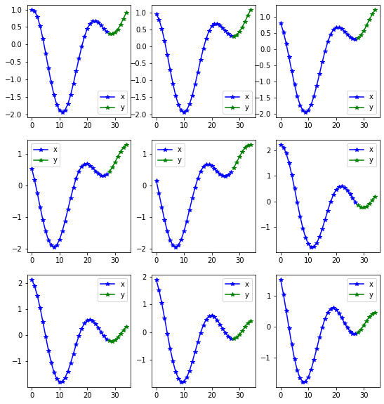

# Fastseq
> A way to use fastai with sequence data


## Installing

Please install [fastai2](https://dev.fast.ai/#Installing) according to the instructions.

Then install Fastseq by:
```
pip install -e .
```

## How to use

```
from fastseq.all import *
from fastai2.basics import *
from fastseq.models.nbeats import *
from fastseq.data.external import *
```

Getting the data fastai style:

```
path = untar_data(URLs.m4_daily)
data = TSDataLoaders.from_folder(path, horizon = 14, nrows = 300,step=3)
```

    Train:68161; Valid: 900; Test 300


```
data.show_batch()
```

    Train:5000; Valid: 8000; Test 1000





```
# TODO make custom learner with custom model
learn = nbeats_learner(data,layers=[512, 512], stack_types=("trend","seasonality"), b_loss=.4, nb_blocks_per_stack=5,
                       loss_func=CombinedLoss(F.mse_loss, smape, ratio = {'smape':.05})
                      )
```


    ---------------------------------------------------------------------------

    AttributeError                            Traceback (most recent call last)

    <ipython-input-8-df9d82c254a7> in <module>
          1 # TODO make custom learner with custom model
          2 learn = nbeats_learner(data,layers=[512, 512], stack_types=("trend","seasonality"), b_loss=.4, nb_blocks_per_stack=5,
    ----> 3                        loss_func=CombinedLoss(F.mse_loss, smape, ratio = {'smape':.05})
          4                       )


    ~/dev/fastseq/fastseq/models/nbeats.py in nbeats_learner(dbunch, output_channels, metrics, cbs, theta, b_loss, loss_func, **kwargs)
        339     "Build a N-Beats style learner"
        340     model = NBeatsNet(
    --> 341         device = dbunch.train_dl.device,
        342         horizon = dbunch.train_dl.horizon,
        343         lookback = dbunch.train_dl.lookback,


    ~/dev/fastcore/fastcore/foundation.py in __getattr__(self, k)
        221             attr = getattr(self,self._default,None)
        222             if attr is not None: return getattr(attr, k)
    --> 223         raise AttributeError(k)
        224     def __dir__(self): return custom_dir(self, self._dir() if self._xtra is None else self._dir())
        225 #     def __getstate__(self): return self.__dict__


    AttributeError: train_dl


```
from fastai2.callback.all import *
learn.lr_find()
```


    ---------------------------------------------------------------------------

    NameError                                 Traceback (most recent call last)

    <ipython-input-9-bd8b18fd11a5> in <module>
          1 from fastai2.callback.all import *
    ----> 2 learn.lr_find()
    

    NameError: name 'learn' is not defined


```
learn.fit_one_cycle(3, 1e-4, cbs=cbs)
learn.recorder.plot_loss()
```


    <div>
        <style>
            /* Turns off some styling */
            progress {
                /* gets rid of default border in Firefox and Opera. */
                border: none;
                /* Needs to be in here for Safari polyfill so background images work as expected. */
                background-size: auto;
            }
            .progress-bar-interrupted, .progress-bar-interrupted::-webkit-progress-bar {
                background: #F44336;
            }
        </style>
      <progress value='0' class='' max='3', style='width:300px; height:20px; vertical-align: middle;'></progress>
      0.00% [0/3 00:00<00:00]
    </div>

<table border="1" class="dataframe">
  <thead>
    <tr style="text-align: left;">
      <th>epoch</th>
      <th>train_loss</th>
      <th>valid_loss</th>
      <th>mae</th>
      <th>smape</th>
      <th>mse_loss</th>
      <th>theta</th>
      <th>b_loss</th>
      <th>time</th>
    </tr>
  </thead>
  <tbody>
  </tbody>
</table><p>

    <div>
        <style>
            /* Turns off some styling */
            progress {
                /* gets rid of default border in Firefox and Opera. */
                border: none;
                /* Needs to be in here for Safari polyfill so background images work as expected. */
                background-size: auto;
            }
            .progress-bar-interrupted, .progress-bar-interrupted::-webkit-progress-bar {
                background: #F44336;
            }
        </style>
      <progress value='185' class='' max='1065', style='width:300px; height:20px; vertical-align: middle;'></progress>
      17.37% [185/1065 00:15<01:13 7.6649]
    </div>


```
learn.show_results(2,max_n=9)
```


## Interperation

```
from fastai2.interpret import *
from fastseq.interpret import *
```

```
interp = NBeatsInterpretation.from_learner(learn)
```


```
interp.plot_top_losses(3)
```


