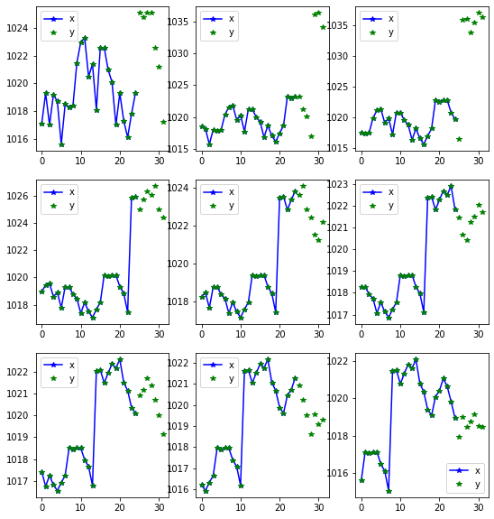

<!--

#################################################
### THIS FILE WAS AUTOGENERATED! DO NOT EDIT! ###
#################################################
# file to edit: nbs/index.ipynb
# command to build the docs after a change: nbdev_build_docs

-->

# Fastseq

> A way to use fastai with sequence data


## Installing

Please install [fastai2](https://dev.fast.ai/#Installing) according to the instructions.

Then install Fastseq by:
```
pip install -e .
```

## How to use
<div class="codecell" markdown="1">
<div class="input_area" markdown="1">

```python
from fastai2.basics import *
from fastseq.all import *
from fastseq.nbeats.model import *
from fastseq.nbeats.learner import *
horizon, lookback = 7, 35    
```

</div>

</div>

Getting the data fastai style:
<div class="codecell" markdown="1">
<div class="input_area" markdown="1">

```python
path = untar_data(URLs.m4_daily)
data = TSDataLoaders.from_folder(path, horizon = horizon, lookback = lookback, nrows = 300, step=3)
```

</div>
<div class="output_area" markdown="1">

    Train:71691; Valid: 1200; Test 300


</div>

</div>
<div class="codecell" markdown="1">
<div class="input_area" markdown="1">

```python
items = dummy_data_generator(60, 10, nrows=300)
data = TSDataLoaders.from_items(items,horizon = horizon, lookback = lookback, step=5, valid_pct=.2)
```

</div>
<div class="output_area" markdown="1">

    Train:1500; Valid: 300; Test 300


</div>

</div>
<div class="codecell" markdown="1">
<div class="input_area" markdown="1">

```python
data.show_batch()
```

</div>
<div class="output_area" markdown="1">





</div>

</div>
<div class="codecell" markdown="1">
<div class="input_area" markdown="1">

```python
learn = nbeats_learner(data)   
learn.loss_func = F.mse_loss
```

</div>

</div>
<div class="codecell" markdown="1">
<div class="input_area" markdown="1">

```python
from fastai2.callback.all import *
learn.lr_find()
```

</div>
<div class="output_area" markdown="1">


</div>

</div>
<div class="codecell" markdown="1">
<div class="input_area" markdown="1">

```python
learn.fit_flat_cos(1, 2e-2)
learn.recorder.plot_loss()
learn.recorder.plot_sched()
```

</div>
<div class="output_area" markdown="1">


<table border="1" class="dataframe">
  <thead>
    <tr style="text-align: left;">
      <th>epoch</th>
      <th>train_loss</th>
      <th>valid_loss</th>
      <th>mae</th>
      <th>smape</th>
      <th>b_loss</th>
      <th>theta</th>
      <th>time</th>
    </tr>
  </thead>
  <tbody>
    <tr>
      <td>0</td>
      <td>106363518976.000000</td>
      <td>52734368669499392.000000</td>
      <td>3515625.500000</td>
      <td>1.475688</td>
      <td>3.627706</td>
      <td>2.115030</td>
      <td>01:05</td>
    </tr>
  </tbody>
</table>


</div>

</div>
<div class="codecell" markdown="1">
<div class="input_area" markdown="1">

```python
learn.show_results(0)
```

</div>
<div class="output_area" markdown="1">


</div>

</div>
<div class="codecell" markdown="1">
<div class="input_area" markdown="1">

```python
learn.show_results(1)
```

</div>
<div class="output_area" markdown="1">


</div>

</div>
<div class="codecell" markdown="1">
<div class="input_area" markdown="1">

```python
learn.loss_func = smape
learn.lr_find()
```

</div>
<div class="output_area" markdown="1">


</div>

</div>
<div class="codecell" markdown="1">
<div class="input_area" markdown="1">

```python
learn.fit_flat_cos(1e-6)
learn.recorder.plot_loss()
learn.recorder.plot_sched()
```

</div>
<div class="output_area" markdown="1">


    ---------------------------------------------------------------------------

    AttributeError                            Traceback (most recent call last)

    <ipython-input-16-4b11aca025bb> in <module>
    ----> 1 learn.fit_fc(1e-6)
          2 learn.recorder.plot_loss()
          3 learn.recorder.plot_sched()


    AttributeError: 'Learner' object has no attribute 'fit_fc'


</div>

</div>

## Interperation
<div class="codecell" markdown="1">
<div class="input_area" markdown="1">

```python
learn.n_beats_attention.means()
```

</div>
<div class="output_area" markdown="1">


<div>
<style scoped>
    .dataframe tbody tr th:only-of-type {
        vertical-align: middle;
    }

    .dataframe tbody tr th {
        vertical-align: top;
    }

    .dataframe thead th {
        text-align: right;
    }
</style>
<table border="1" class="dataframe">
  <thead>
    <tr style="text-align: right;">
      <th></th>
      <th>trend0_0</th>
      <th>trend0_1</th>
      <th>seasonality1_0</th>
      <th>seasonality1_1</th>
      <th>seasonality1_2</th>
      <th>seasonality1_3</th>
    </tr>
  </thead>
  <tbody>
    <tr>
      <th>theta_0_mean</th>
      <td>-0.074099414</td>
      <td>-0.07426101</td>
      <td>0.4293354</td>
      <td>0.15625</td>
      <td>-1.5939595</td>
      <td>0.35737035</td>
    </tr>
    <tr>
      <th>theta_0_std</th>
      <td>0.18427914</td>
      <td>0.18240511</td>
      <td>1.1435487</td>
      <td>0.54097944</td>
      <td>0.81059384</td>
      <td>1.2032012</td>
    </tr>
    <tr>
      <th>theta_1_mean</th>
      <td>-0.006618</td>
      <td>-0.0060307784</td>
      <td>-0.733439</td>
      <td>-0.92187035</td>
      <td>0.69952923</td>
      <td>-0.35547772</td>
    </tr>
    <tr>
      <th>theta_1_std</th>
      <td>0.018844062</td>
      <td>0.009154702</td>
      <td>0.4438819</td>
      <td>0.27048832</td>
      <td>0.45268404</td>
      <td>0.6103023</td>
    </tr>
    <tr>
      <th>theta_2_mean</th>
      <td>-0.0016885607</td>
      <td>0.00012500375</td>
      <td>-0.53056526</td>
      <td>0.15625</td>
      <td>0.25669834</td>
      <td>-1.6763806e-07</td>
    </tr>
    <tr>
      <th>theta_2_std</th>
      <td>0.00072945596</td>
      <td>0.0004879491</td>
      <td>1.193347</td>
      <td>0.54097944</td>
      <td>0.41068566</td>
      <td>4.3785803e-07</td>
    </tr>
    <tr>
      <th>att_mean</th>
      <td>0.947958</td>
      <td>0.41586</td>
      <td>0.490716</td>
      <td>0.289062</td>
      <td>0.64974</td>
      <td>0.584103</td>
    </tr>
    <tr>
      <th>att_std</th>
      <td>0.221936</td>
      <td>0.490302</td>
      <td>0.49319</td>
      <td>0.453327</td>
      <td>0.474961</td>
      <td>0.466623</td>
    </tr>
    <tr>
      <th>theta_3_mean</th>
      <td>NaN</td>
      <td>-6.5637076e-05</td>
      <td>NaN</td>
      <td>-0.078125</td>
      <td>1.5937493</td>
      <td>-0.07927033</td>
    </tr>
    <tr>
      <th>theta_3_std</th>
      <td>NaN</td>
      <td>9.4638235e-05</td>
      <td>NaN</td>
      <td>0.27048972</td>
      <td>0.81101006</td>
      <td>0.92355716</td>
    </tr>
    <tr>
      <th>theta_4_mean</th>
      <td>NaN</td>
      <td>NaN</td>
      <td>NaN</td>
      <td>NaN</td>
      <td>3.9115548e-08</td>
      <td>-0.3905308</td>
    </tr>
    <tr>
      <th>theta_4_std</th>
      <td>NaN</td>
      <td>NaN</td>
      <td>NaN</td>
      <td>NaN</td>
      <td>2.5492858e-07</td>
      <td>0.8090458</td>
    </tr>
    <tr>
      <th>theta_5_mean</th>
      <td>NaN</td>
      <td>NaN</td>
      <td>NaN</td>
      <td>NaN</td>
      <td>NaN</td>
      <td>-0.030955186</td>
    </tr>
    <tr>
      <th>theta_5_std</th>
      <td>NaN</td>
      <td>NaN</td>
      <td>NaN</td>
      <td>NaN</td>
      <td>NaN</td>
      <td>0.11994398</td>
    </tr>
  </tbody>
</table>
</div>


</div>

</div>
