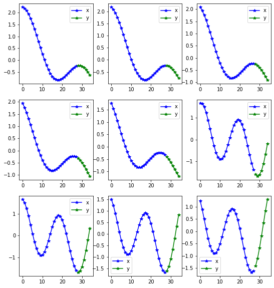
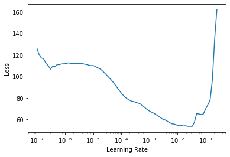

<!--

#################################################
### THIS FILE WAS AUTOGENERATED! DO NOT EDIT! ###
#################################################
# file to edit: nbs/index.ipynb
# command to build the docs after a change: nbdev_build_docs

-->

# Fastseq

> A way to use fastai with sequence data


This file will become your README and also the index of your documentation.

## How to use
<div class="codecell" markdown="1">
<div class="input_area" markdown="1">

```python
from fastseq.all import *
from fastai2.basics import *
from fastseq.models.nbeats import *
from fastseq.data.external import *
```

</div>
<div class="output_area" markdown="1">

    /home/tako/dev/env37/lib/python3.7/site-packages/pandas/compat/__init__.py:85: UserWarning: Could not import the lzma module. Your installed Python is incomplete. Attempting to use lzma compression will result in a RuntimeError.
      warnings.warn(msg)


</div>

</div>

Getting the data fastai style:
<div class="codecell" markdown="1">
<div class="input_area" markdown="1">

```python
items = dummy_data_generator(50, 10, nrows=1000)
data = TSDataBunch.from_items(items, horizon = 7)
data.show_batch()
```

</div>
<div class="output_area" markdown="1">

    Train:5000; Valid: 8000; Test 1000





</div>

</div>
<div class="codecell" markdown="1">
<div class="input_area" markdown="1">

```python
# TODO make custom learner with custom model
learn = nbeats_learner(data)
```

</div>

</div>
<div class="codecell" markdown="1">
<div class="input_area" markdown="1">

```python
from fastai2.callback.all import *
learn.lr_find()
```

</div>
<div class="output_area" markdown="1">





</div>

</div>
<div class="codecell" markdown="1">
<div class="input_area" markdown="1">

```python
learn.fit_one_cycle(10, 2e-3)
learn.recorder.plot_loss()
```

</div>
<div class="output_area" markdown="1">


<table border="1" class="dataframe">
  <thead>
    <tr style="text-align: left;">
      <th>epoch</th>
      <th>train_loss</th>
      <th>valid_loss</th>
      <th>mae</th>
      <th>smape</th>
      <th>mse_loss</th>
      <th>time</th>
    </tr>
  </thead>
  <tbody>
    <tr>
      <td>0</td>
      <td>7.987509</td>
      <td>1.405302</td>
      <td>0.972781</td>
      <td>831.637634</td>
      <td>1.404471</td>
      <td>00:07</td>
    </tr>
    <tr>
      <td>1</td>
      <td>4.172364</td>
      <td>2.946396</td>
      <td>1.275216</td>
      <td>953.840759</td>
      <td>2.945442</td>
      <td>00:07</td>
    </tr>
    <tr>
      <td>2</td>
      <td>4.205298</td>
      <td>1.827061</td>
      <td>0.931817</td>
      <td>554.108154</td>
      <td>1.826507</td>
      <td>00:07</td>
    </tr>
    <tr>
      <td>3</td>
      <td>5.215362</td>
      <td>1.653857</td>
      <td>0.926697</td>
      <td>599.112671</td>
      <td>1.653258</td>
      <td>00:07</td>
    </tr>
    <tr>
      <td>4</td>
      <td>2.404902</td>
      <td>1.368180</td>
      <td>0.849797</td>
      <td>559.373230</td>
      <td>1.367620</td>
      <td>00:07</td>
    </tr>
    <tr>
      <td>5</td>
      <td>1.283748</td>
      <td>0.564452</td>
      <td>0.569135</td>
      <td>535.169922</td>
      <td>0.563917</td>
      <td>00:07</td>
    </tr>
    <tr>
      <td>6</td>
      <td>0.556387</td>
      <td>0.692982</td>
      <td>0.619801</td>
      <td>536.428772</td>
      <td>0.692445</td>
      <td>00:08</td>
    </tr>
    <tr>
      <td>7</td>
      <td>0.361346</td>
      <td>0.552994</td>
      <td>0.567599</td>
      <td>540.136230</td>
      <td>0.552454</td>
      <td>00:08</td>
    </tr>
    <tr>
      <td>8</td>
      <td>0.226773</td>
      <td>0.698564</td>
      <td>0.629553</td>
      <td>552.179565</td>
      <td>0.698012</td>
      <td>00:08</td>
    </tr>
    <tr>
      <td>9</td>
      <td>0.174508</td>
      <td>0.632865</td>
      <td>0.595756</td>
      <td>535.850708</td>
      <td>0.632329</td>
      <td>00:08</td>
    </tr>
  </tbody>
</table>


</div>

</div>
<div class="codecell" markdown="1">
<div class="input_area" markdown="1">

```python
learn.show_results(2,max_n=9)
```

</div>
<div class="output_area" markdown="1">


</div>

</div>
