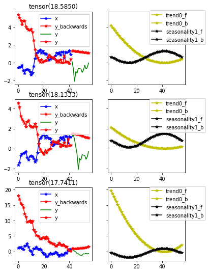

# Fastseq
> A way to use fastai with sequence data


## Installing

Please install [fastai2](https://dev.fast.ai/#Installing) according to the instructions.

Then install Fastseq by:
```
pip install -e .
```

## How to use

```python
from fastseq.all import *
from fastai2.basics import *
from fastseq.models.nbeats import *
from fastseq.data.external import *
```

Getting the data fastai style:

```python
path = untar_data(URLs.m4_daily)
data = TSDataLoaders.from_folder(path, horizon = 14, nrows = 300,step=3)
```

    Train:68161; Valid: 900; Test 300


```python
# items = dummy_data_generator(50, 10, nrows=1000)
# data = TSDataLoaders.from_items(items, horizon = 7)
data.show_batch()
```


```python
# TODO make custom learner with custom model
learn = nbeats_learner(data,layers=[512, 512], stack_types=("trend","seasonality"), b_loss=.4, nb_blocks_per_stack=5,
                       loss_func=CombinedLoss(F.mse_loss, smape, ratio = {'smape':.05})
                      )
```

```python
from fastai2.callback.all import *
learn.lr_find()
```


```python
learn.fit_one_cycle(3, 1e-4)
learn.recorder.plot_loss()
```


<table border="1" class="dataframe">
  <thead>
    <tr style="text-align: left;">
      <th>epoch</th>
      <th>train_loss</th>
      <th>valid_loss</th>
      <th>mae</th>
      <th>smape</th>
      <th>mse_loss</th>
      <th>theta</th>
      <th>b_loss</th>
      <th>time</th>
    </tr>
  </thead>
  <tbody>
    <tr>
      <td>0</td>
      <td>11.667146</td>
      <td>10.400988</td>
      <td>0.726101</td>
      <td>0.982751</td>
      <td>0.925580</td>
      <td>5.981860</td>
      <td>132.845291</td>
      <td>01:32</td>
    </tr>
    <tr>
      <td>1</td>
      <td>7.654520</td>
      <td>10.266610</td>
      <td>0.698656</td>
      <td>1.001247</td>
      <td>0.811926</td>
      <td>7.290051</td>
      <td>128.003708</td>
      <td>01:30</td>
    </tr>
    <tr>
      <td>2</td>
      <td>6.745286</td>
      <td>10.285508</td>
      <td>0.723681</td>
      <td>0.960909</td>
      <td>0.882981</td>
      <td>7.249493</td>
      <td>126.368530</td>
      <td>01:30</td>
    </tr>
  </tbody>
</table>


```python
learn.show_results(2,max_n=9)
```


## Interperation

```python
from fastai2.interpret import *
from fastseq.interpret import *
```

```python
interp = NBeatsInterpretation.from_learner(learn)
```


```python
interp.plot_top_losses(3)
```




