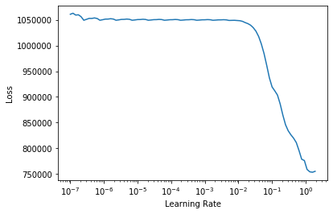
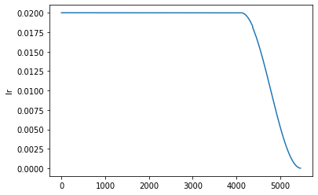
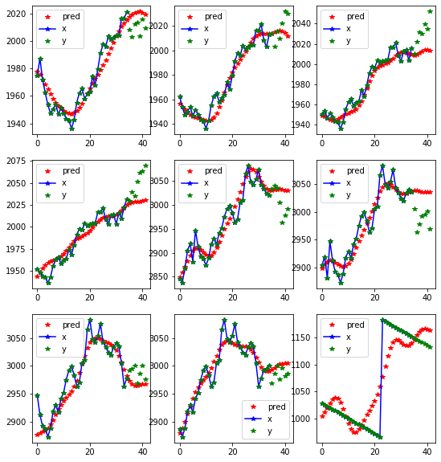
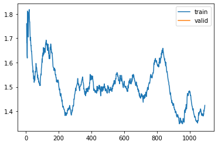
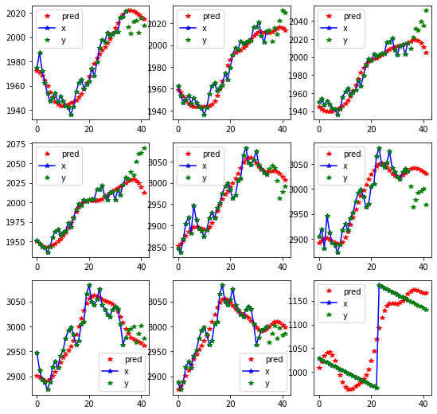
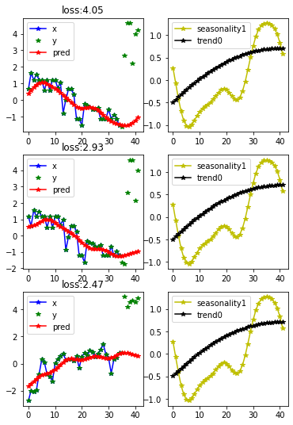

# Fastseq
> A way to use fastai with sequence data


## Installing

Please install [fastai2](https://dev.fast.ai/#Installing) according to the instructions.

Then install Fastseq by:

```
git clone https://github.com/takotab/fastseq.git
cd fastseq
pip install -e .
```

Please be aware that this extention on fastai2 is made for univarate data (The difference is explained [here](https://stats.stackexchange.com/a/342821/159578)).


If you have tried it, please let me know. Even if you got stuck and werent able to install. You can send me an [email](mailto:TakoTabak+fastseq@gmail.com), leave a comment in the (excelent) [fastai timeseries forum](https://forums.fast.ai/t/time-series-sequential-data-study-group/29686), or make an issue in [github](https://github.com/takotab/fastseq/issues). I would love to know what you think of libary any tips or comments. Do you work on these kind of data, would want more explanation of the model, would you like to see the approuch on multivariate ts. Where do think I should go with this.

Thank you

## How to use

```python
from fastai2.basics import *
from fastseq.all import *
from fastseq.nbeats.model import *
from fastseq.nbeats.learner import *
from fastseq.nbeats.callbacks import *
```

```python
horizon, lookback = 7, 35    
```

Getting the data fastai style:

```python
path = untar_data(URLs.m4_daily)
data = TSDataLoaders.from_folder(path, horizon = horizon, lookback = lookback, nrows = 300, step=3)
```

    torch.Size([1, 1020])
    Train:70707; Valid: 1200; Test 300


```python
data.show_batch()
```





```python
learn = nbeats_learner(data, season = lookback+horizon)   
```

```python
from fastai2.callback.all import *
learn.lr_find()
```


    SuggestedLRs(lr_min=0.10964782238006592, lr_steep=2.75422871709452e-06)





```python
learn.fit_flat_cos(5, 2e-2)
learn.recorder.plot_loss()
learn.recorder.plot_sched()
```


<table border="1" class="dataframe">
  <thead>
    <tr style="text-align: left;">
      <th>epoch</th>
      <th>train_loss</th>
      <th>valid_loss</th>
      <th>mae</th>
      <th>smape</th>
      <th>theta</th>
      <th>b_loss</th>
      <th>f_loss</th>
      <th>f_smape</th>
      <th>time</th>
    </tr>
  </thead>
  <tbody>
    <tr>
      <td>0</td>
      <td>1.810993</td>
      <td>1.584216</td>
      <td>0.512324</td>
      <td>0.814250</td>
      <td>1.686225</td>
      <td>nan</td>
      <td>nan</td>
      <td>0.110506</td>
      <td>01:09</td>
    </tr>
    <tr>
      <td>1</td>
      <td>1.704236</td>
      <td>1.457823</td>
      <td>0.486268</td>
      <td>0.774352</td>
      <td>1.888560</td>
      <td>nan</td>
      <td>nan</td>
      <td>0.105555</td>
      <td>01:10</td>
    </tr>
    <tr>
      <td>2</td>
      <td>1.649843</td>
      <td>1.489586</td>
      <td>0.480835</td>
      <td>0.770334</td>
      <td>1.615496</td>
      <td>nan</td>
      <td>nan</td>
      <td>0.108494</td>
      <td>01:11</td>
    </tr>
    <tr>
      <td>3</td>
      <td>1.599777</td>
      <td>1.418724</td>
      <td>0.476658</td>
      <td>0.752617</td>
      <td>1.705645</td>
      <td>nan</td>
      <td>nan</td>
      <td>0.103655</td>
      <td>01:09</td>
    </tr>
    <tr>
      <td>4</td>
      <td>1.490466</td>
      <td>1.363848</td>
      <td>0.440083</td>
      <td>0.709690</td>
      <td>1.960501</td>
      <td>nan</td>
      <td>nan</td>
      <td>0.102861</td>
      <td>01:10</td>
    </tr>
  </tbody>
</table>


```python
learn.show_results(0)
```





```python
learn.show_results(1)
```





```python
learn.fit_flat_cos(1,5e-4)
learn.recorder.plot_loss()
learn.recorder.plot_sched()
```


<table border="1" class="dataframe">
  <thead>
    <tr style="text-align: left;">
      <th>epoch</th>
      <th>train_loss</th>
      <th>valid_loss</th>
      <th>mae</th>
      <th>smape</th>
      <th>theta</th>
      <th>b_loss</th>
      <th>f_loss</th>
      <th>f_smape</th>
      <th>time</th>
    </tr>
  </thead>
  <tbody>
    <tr>
      <td>0</td>
      <td>1.424263</td>
      <td>1.343198</td>
      <td>0.420948</td>
      <td>0.683976</td>
      <td>1.796664</td>
      <td>nan</td>
      <td>nan</td>
      <td>0.100251</td>
      <td>01:28</td>
    </tr>
  </tbody>
</table>





## Interperation

```python
learn.n_beats_attention.means()
```


<div>
<style scoped>
    .dataframe tbody tr th:only-of-type {
        vertical-align: middle;
    }

    .dataframe tbody tr th {
        vertical-align: top;
    }

    .dataframe thead th {
        text-align: right;
    }
</style>
<table border="1" class="dataframe">
  <thead>
    <tr style="text-align: right;">
      <th></th>
      <th>trend0_0</th>
      <th>trend0_1</th>
      <th>seasonality1_0</th>
      <th>seasonality1_1</th>
      <th>seasonality1_2</th>
      <th>seasonality1_3</th>
    </tr>
  </thead>
  <tbody>
    <tr>
      <th>theta_0_mean</th>
      <td>1.2808248</td>
      <td>0.12578407</td>
      <td>-0.08569077</td>
      <td>-0.06187745</td>
      <td>0.1796875</td>
      <td>1.0902514</td>
    </tr>
    <tr>
      <th>theta_0_std</th>
      <td>0.26519</td>
      <td>0.08104574</td>
      <td>0.66268957</td>
      <td>0.4097473</td>
      <td>0.12173311</td>
      <td>0.6663508</td>
    </tr>
    <tr>
      <th>theta_1_mean</th>
      <td>0.0</td>
      <td>-0.0008654712</td>
      <td>0.32511836</td>
      <td>0.2971403</td>
      <td>-0.24606797</td>
      <td>0.14985758</td>
    </tr>
    <tr>
      <th>theta_1_std</th>
      <td>0.0</td>
      <td>0.0025685464</td>
      <td>0.279926</td>
      <td>0.2816404</td>
      <td>0.298546</td>
      <td>0.3349468</td>
    </tr>
    <tr>
      <th>theta_2_mean</th>
      <td>-0.0041518696</td>
      <td>0.001206975</td>
      <td>0.08984375</td>
      <td>-0.11661168</td>
      <td>-0.04089954</td>
      <td>-0.062004503</td>
    </tr>
    <tr>
      <th>theta_2_std</th>
      <td>0.0010466882</td>
      <td>0.00050746487</td>
      <td>0.14342181</td>
      <td>0.20864268</td>
      <td>0.1293545</td>
      <td>0.12580697</td>
    </tr>
    <tr>
      <th>theta_3_mean</th>
      <td>0.015779227</td>
      <td>4.6875e-06</td>
      <td>NaN</td>
      <td>0.25079164</td>
      <td>0.036999673</td>
      <td>0.054956526</td>
    </tr>
    <tr>
      <th>theta_3_std</th>
      <td>0.15912743</td>
      <td>1.4689242e-05</td>
      <td>NaN</td>
      <td>0.31157577</td>
      <td>0.22201656</td>
      <td>0.59105575</td>
    </tr>
    <tr>
      <th>theta_4_mean</th>
      <td>1.11071</td>
      <td>0.023908217</td>
      <td>NaN</td>
      <td>NaN</td>
      <td>-0.025488539</td>
      <td>0.0049164467</td>
    </tr>
    <tr>
      <th>theta_4_std</th>
      <td>0.22121297</td>
      <td>0.020769339</td>
      <td>NaN</td>
      <td>NaN</td>
      <td>0.057381537</td>
      <td>0.33296514</td>
    </tr>
    <tr>
      <th>theta_5_mean</th>
      <td>-0.6289774</td>
      <td>0.27862015</td>
      <td>NaN</td>
      <td>NaN</td>
      <td>NaN</td>
      <td>-0.040294748</td>
    </tr>
    <tr>
      <th>theta_5_std</th>
      <td>0.7376536</td>
      <td>0.43712172</td>
      <td>NaN</td>
      <td>NaN</td>
      <td>NaN</td>
      <td>0.12889466</td>
    </tr>
    <tr>
      <th>att_mean</th>
      <td>0.767369</td>
      <td>0.638013</td>
      <td>0.590672</td>
      <td>0.59922</td>
      <td>0.775596</td>
      <td>0.999996</td>
    </tr>
    <tr>
      <th>att_std</th>
      <td>0.373486</td>
      <td>0.444871</td>
      <td>0.488639</td>
      <td>0.487674</td>
      <td>0.411862</td>
      <td>1.40701e-05</td>
    </tr>
    <tr>
      <th>theta_6_mean</th>
      <td>NaN</td>
      <td>1.1543798</td>
      <td>NaN</td>
      <td>NaN</td>
      <td>NaN</td>
      <td>NaN</td>
    </tr>
    <tr>
      <th>theta_6_std</th>
      <td>NaN</td>
      <td>0.49151137</td>
      <td>NaN</td>
      <td>NaN</td>
      <td>NaN</td>
      <td>NaN</td>
    </tr>
    <tr>
      <th>theta_7_mean</th>
      <td>NaN</td>
      <td>1.1794331</td>
      <td>NaN</td>
      <td>NaN</td>
      <td>NaN</td>
      <td>NaN</td>
    </tr>
    <tr>
      <th>theta_7_std</th>
      <td>NaN</td>
      <td>0.5685613</td>
      <td>NaN</td>
      <td>NaN</td>
      <td>NaN</td>
      <td>NaN</td>
    </tr>
  </tbody>
</table>
</div>


```python
interp = NBeatsInterpretation.from_learner(learn)
```


```python
interp.plot_top_losses(3, combine_stack=True)
```




